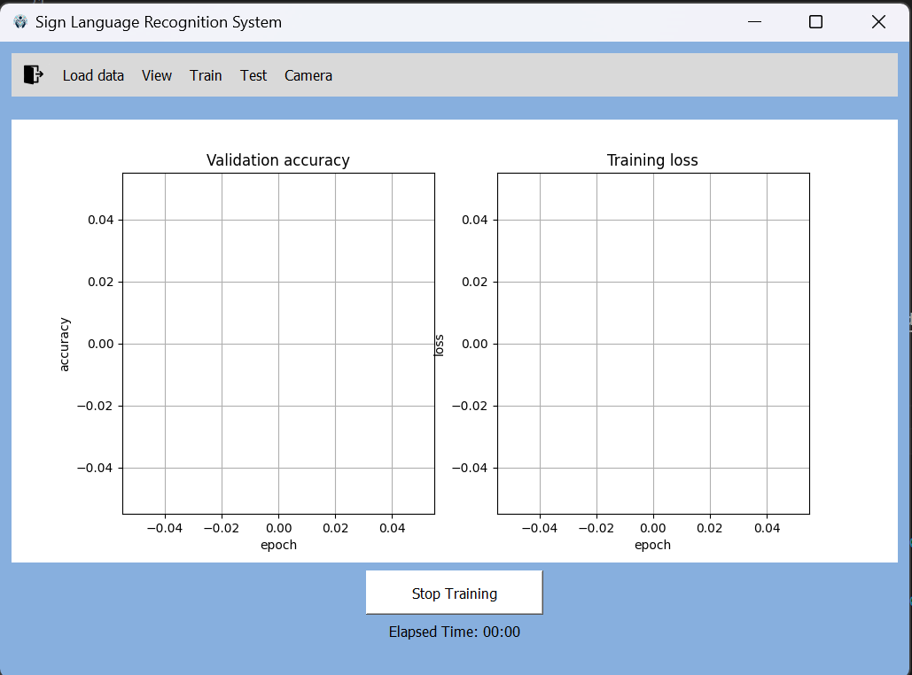

# COMPSYS 302: Project 2

This project is the second part of COMPSYS 302 in 2024, made by Mardee, Jenny and Teresa. 
In this project, we used and integrated 3 different DNN models to create a Sign Language Interpreter inside our custom made GUI.

Our team initally, wanted to use inceptionV3 and resnet18 as our 2 models, so our first version of our project had implemented these 2 models, but later discovered that these models have a large number of parameters which took a long time on our slow devices. In hopes of speeding our work progress we decided to use MnasNet, MmobileNet and a Custom model in our final version of our project.

To run this applicaton on your own computer:

# Step 1) **Setting up project**
- clone repository (if viewing this project on Github)
- unzip file in an easily accesible location
- run GUI.py 

**NOTE: Make sure you have the csv file (dataset) on local device**

Download here:
https://canvas.auckland.ac.nz/files/12537451/download?download_frd=1

**If "CSV_images" and "data_images" is in the directory please delete to properly demonstrate our *"load data"* functionaltiy**

Our GUI looks like this:

# Step 2) **Loading the data**
- Click *"Load Data"* on the toolbar

**THIS TOOLBAR IS OUR CORE NAVIGATION OF OUR GUI**

- Locate and choose the csv file to load the data

Once the csv to image conversion is done:

- Click on View in our toolbar to look at all the images

*the search bar lets you search images by its class number*

e.g **0-35**

# Step 3) **Training**
- Click *"Train"* on toolbar to go to training interface

- Select one of our 3 models **Custom, MnasNet, and MmobileNet"
- move sliders to change Testing ratio, Batch size and Number of Epochs accordingly 
- Once you have configured your training accordingly, Click *"Start Training"* button to continue

**IMPORTANT: Remember what model you chose, batch size and number of epochs you trained later for testing**

**WATCH VIDEO BELOW FOR REFERENCE**

https://github.com/COMPSYS302/project-python-group-3/assets/121736600/afe70687-4210-4dee-b5d6-ddba594005e6

You should now see this screen: 

**Elapsed time=** the time you have been training for

**Graphs=** show loss and accuracy after every epoch is finished

**Stopped Training=** clickable button that brings you back to the training interface screen to change  configuration

**NOTE: wait for the "Training finished" pop up indicating training is finished**

# Step 4) Testing

- Once Training is finished (pop up dialog will notify when done)
- You can click *"Test"* in the toolbar to move on to testing

Our Testing interface looks like:

- Firstly, if you remember your training configuration from **Step 3)** select the correct model inside the drop down

your trained model should be in the form: **{model name}_bs{batch size}_epochs{number of epochs}.pt**

e.g. *Custom_bs16_epochs4.pt*

- Choose one of the balck & white photos to bring up a pop up of the models prediciton to what the sign language is

**Select Image button will make more sense in Step 5**

# Step 5) Camera testing 

**THIS STEP WILL ONLY WORK IF YOU HAVE A WEBCAM**

- Click on *"Camera"* on our toolbar to bring up your device's camera
- take a snapshot (click **"c"** on keyboard to take a photo) of one of the sign languages as seen below

**NOTE: try to have a plain background and your hand doing the sign language in your photo**

As seen below:

-- To close the webcam window click **"q"** on your keyboard

- Go back to the Test interface by clicking on test in our toolbar 
- Click *"Select Image"* and choose the image you took
- A pop up should come up of the models prediciton as seen in **Step 4**
